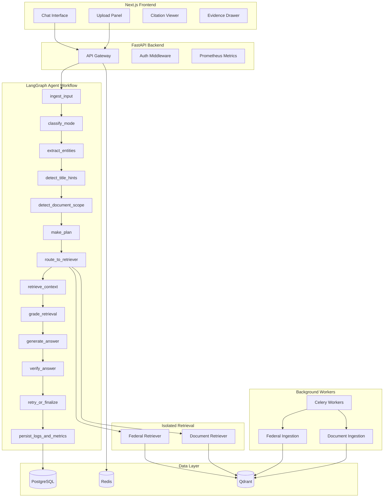
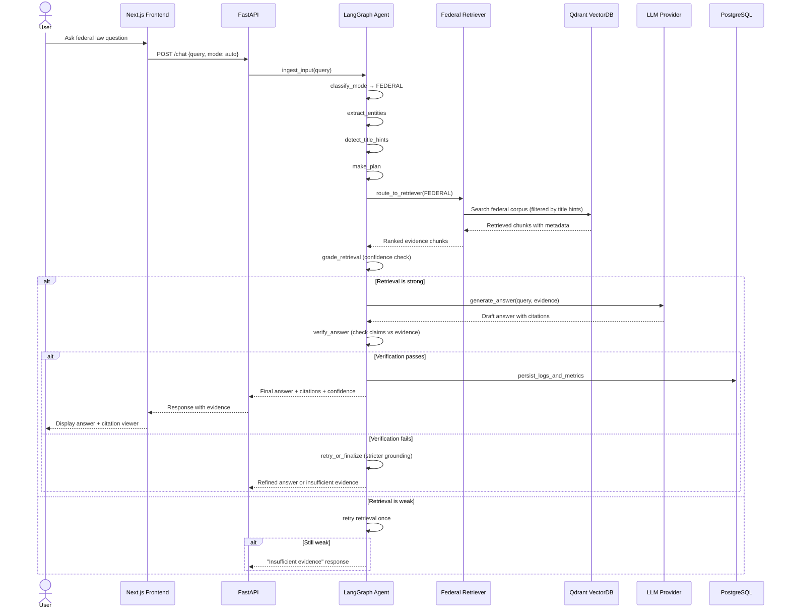
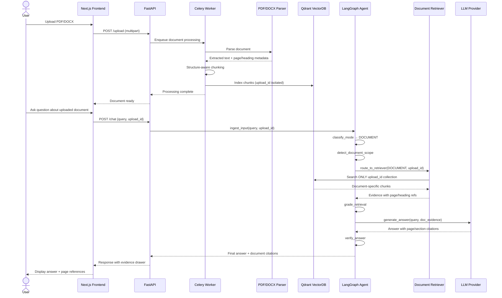

# Dual-Mode Federal Law and Document AI Intake Agent

A production-grade AI-powered legal research system with two strictly isolated modes:

1. **Federal Legal Knowledge Q&A** — Answer general U.S. federal law questions using a curated corpus of selected U.S. Code titles (8, 11, 15, 18, 26, 28, 29, 42) with retrieval-augmented generation and citation support.
2. **Legal Document Q&A** — Upload PDF/DOCX/TXT files and ask questions grounded only in the uploaded document, with page/section/clause-level citations.

> **🆕 Documentation Updates**:
> - For a deep dive into architecture and design decisions, see [info.md](info.md).
> - For the latest development status and fixed issues, see [log.md](log.md).
> - For a step-by-step free deployment on Oracle Cloud, see [ORACLE_DEPLOYMENT.md](docs/ORACLE_DEPLOYMENT.md).

> **⚠️ Disclaimer**: This system does NOT provide legal advice. All outputs are informational only and based on retrieved statutory text. Consult a qualified attorney for legal guidance.

---

## Architecture



## Sequence Diagrams

### Federal Legal Knowledge Q&A Mode



### Legal Document Q&A Mode



---

## Tech Stack

| Layer | Technology |
|-------|-----------|
| Frontend | Next.js, React, Tailwind CSS |
| Backend | Python, FastAPI, Uvicorn, Pydantic |
| Database | PostgreSQL, SQLAlchemy, Alembic |
| Cache/Queue | Redis, Celery |
| Vector Store | Qdrant |
| Agent Framework | LangGraph |
| Document Parsing | PyMuPDF, python-docx, pdfplumber |
| Federal Corpus | lxml, USLM XML parsing |
| Observability | Prometheus metrics |
| Infra | Docker, Docker Compose, Nginx |

---

## Project Structure

```
├── backend/
│   ├── app/
│   │   ├── api/            # FastAPI routes
│   │   ├── agents/         # LangGraph workflow
│   │   ├── retrieval/      # Federal + Document retrievers
│   │   ├── ingestion/      # Federal corpus XML parsing
│   │   ├── document_ingestion/  # PDF/DOCX processing
│   │   ├── database/       # SQLAlchemy models + Alembic
│   │   ├── services/       # Business logic
│   │   ├── observability/  # Prometheus metrics
│   │   ├── workers/        # Celery tasks
│   │   ├── core/           # Config, settings, utils
│   │   └── tests/          # Test suite
│   ├── alembic/            # Database migrations
│   ├── Dockerfile
│   └── requirements.txt
├── frontend/
│   ├── src/
│   ├── Dockerfile
│   └── package.json
├── infra/
│   ├── docker-compose.yml
│   ├── nginx.conf
│   └── .env.example
├── docs/
├── scripts/
└── sample_data/
```

---

## Quick Start

### Prerequisites
- Docker & Docker Compose
- Python 3.11+
- Node.js 18+

### Local Development

```bash
# 1. Clone and configure
cp infra/.env.example .env

# 2. Start infrastructure
docker compose -f infra/docker-compose.yml up -d

# 3. Run backend
cd backend
pip install -r requirements.txt
alembic upgrade head
uvicorn app.main:app --reload --port 8000

# 4. Run frontend
cd frontend
npm install
npm run dev

# 5. Ingest federal corpus
python -m app.ingestion.run_ingestion
```

### Docker Deployment

```bash
docker compose -f infra/docker-compose.yml --profile full up --build
```

---

## Deployment (100% Free Forever Stack)

This project is optimized to run entirely on the **Free Tiers** of various cloud providers, ensuring $0/month cost.

### 1. Provision Free Services
You will need to create free accounts and get connection strings from these providers:

*   **Frontend & Backend**: [Render](https://render.com) (Free Web Service)
*   **Database**: [Supabase](https://supabase.com) (Free Postgres)
*   **Vector Store**: [Qdrant Cloud](https://qdrant.tech/cloud/) (Free Cluster)
*   **Redis (Cache/Queue)**: [Upstash](https://upstash.com) (Free Redis)

### 2. Configure Render Blueprint
1.  Log in to [Render](https://dashboard.render.com/) and click **New > Blueprint**.
2.  Connect your GitHub repository.
3.  Render will detect the `render.yaml` file. Click **Apply**.
4.  **Important**: In the Render dashboard, go to the **backend** service and set these Environment Variables:
    *   `DATABASE_URL`: Your Supabase URI (`postgresql://...`)
    *   `REDIS_URL`: Your Upstash Redis URL (`redis://...`)
    *   `QDRANT_HOST`: Your Qdrant Cloud Cluster URL (`https://...`)
    *   `QDRANT_API_KEY`: Your Qdrant Cloud API Key
    *   `OPENAI_API_KEY`: Your OpenAI API Key

### 3. Data Ingestion (Free Tier)
Since Render's free tier has no persistent disk, the federal law XML data is not stored on the server.
1.  **Local Ingestion**: The easiest way is to run the ingestion from your local machine, pointing to your **Qdrant Cloud** URL.
    ```bash
    # In your local backend folder
    export QDRANT_HOST="https://your-qdrant-cloud-url"
    export QDRANT_API_KEY="your-api-key"
    python -m app.ingestion.run_ingestion
    ```
2.  **Document Uploads**: In the "Document Q&A" mode, files you upload are processed and stored in Qdrant Cloud. They will persist even if the Render service restarts.

---

---

## API Endpoints

| Endpoint | Method | Description |
|----------|--------|-------------|
| `/chat` | POST | Submit a query (auto-detects mode or uses explicit mode) |
| `/upload` | POST | Upload PDF/DOCX for document Q&A |
| `/retrieval` | POST | Direct retrieval endpoint for testing |
| `/health` | GET | Overall health check |
| `/health/live` | GET | Liveness probe |
| `/health/ready` | GET | Readiness probe |
| `/metrics` | GET | Prometheus metrics endpoint |

---

## Federal Corpus

> [!NOTE]
> **Current Scope**: Due to vector storage and performance constraints in the current development environment, the RAG index is currently optimized for **Title 11 (Bankruptcy)** and **Title 26 (Internal Revenue Code)**.

The system is architected to ingest U.S. Code XML (USLM format). The following titles are supported by the parser, with **11** and **26** currently active in the production-ready index:

| Title | Subject | Status |
|-------|---------|--------|
| 8 | Aliens and Nationality | Parser Ready |
| **11** | **Bankruptcy** | **Index Active** |
| 15 | Commerce and Trade | Parser Ready |
| 18 | Crimes and Criminal Procedure | Parser Ready |
| **26** | **Internal Revenue Code** | **Index Active** |
| 28 | Judiciary and Judicial Procedure | Parser Ready |
| 29 | Labor | Parser Ready |
| 42 | The Public Health and Welfare | Parser Ready |

---

## Roadmap & Future Plans

We are actively working to expand the system's breadth and depth:

1.  **Full U.S. Code Coverage**: Expanding the elastic vector index to support all 54 U.S. Code titles.
2.  **State Law Integration**: Incorporating state-level statutes, starting with major jurisdictions (CA, NY, TX, FL).
3.  **Jurisdictional Cross-Referencing**: Enabling the agent to identify conflicts or overlaps between federal and state laws.
4.  **Case Law Integration**: Moving beyond statutes to include relevant judicial precedents and court rulings.

---

## Mode Isolation Rules

1. **Federal mode**: Retrieves ONLY from the federal U.S. Code corpus
2. **Document mode**: Retrieves ONLY from the active uploaded document
3. **Ambiguous queries**: System asks a clarifying question
4. **Never mix**: Federal and document evidence are never combined
5. **No silent fallback**: If retrieval is weak, the system says so explicitly

---

## License

MIT
